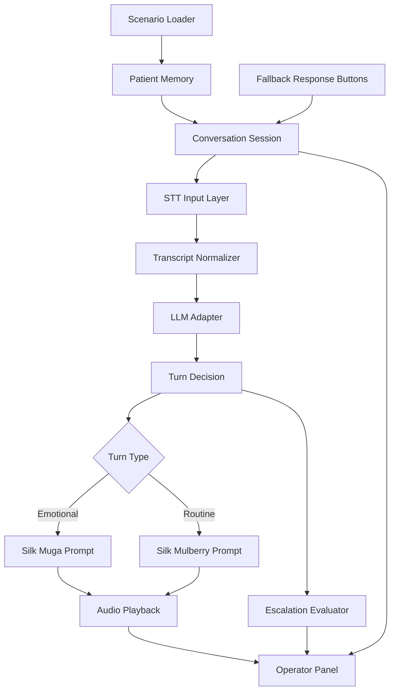

## Summary

Cocoon is a browser-based outbound AI voice agent that checks on patients after discharge or treatment, starting with a diabetic post-surgical scenario that combines chronic-care adherence and post-op symptom follow-up. The hackathon MVP showcases a realtime voice pipeline — Deepgram STT, pluggable LLM decisioning, and Rumik Silk TTS — with a live operator panel and a silent fallback path when STT fails.

---

## Problem Frame

Patients often do not proactively call their provider after surgery, discharge, or chronic-care visits, even when they are confused about medication, experiencing symptoms, or missing doses. Hospitals and clinics also struggle to run timely, personalized follow-up at scale, especially in the patient's preferred language.

For the hackathon demo, Cocoon needs to make that problem tangible in one screen and one voice interaction. It must feel personal, multilingual, and clinically aware without drifting into diagnosis or brittle scripted behavior. The product story is a hospital workflow tool that already knows who it is calling, why it is calling, and when to escalate to a human.

---

## Scope Boundaries

### In scope for tomorrow's MVP
- Browser-based simulated outbound call initiated from a "Call me" button
- At least 2 patient scenarios, with a diabetic post-surgical patient as the primary demo
- Hinglish / Hindi-first voice experience with English fallback
- Pre-seeded patient memory and care-plan context per scenario
- Deepgram STT as primary patient input path
- Operator-button fallback when STT fails or is unreliable
- LLM-driven turn-by-turn conversation with escalation logic
- Rumik Silk TTS using Muga for emotional turns and Mulberry 1.5 for routine turns
- Operator panel showing patient summary, live transcript, call state, and escalation outcome

### Deferred for later
- Real PSTN/SIP calling
- Persistent patient memory across sessions
- Hospital EMR/EHR integrations
- Scheduling, retries, and missed-call handling
- Additional languages beyond Hindi/Hinglish + English fallback
- Caregiver / family alert workflows
- HIPAA-grade storage, auth, and auditability
- Clinician queue workflows beyond a simple escalation card

### Outside this product's identity
- Diagnosis generation
- Autonomous medical advice beyond provider-approved follow-up language
- Emergency triage replacement
- Inbound patient messaging or chatbot workflows

---

## Key Technical Decisions

1. **Use a browser-simulated outbound call instead of real telephony for the MVP**
   - Keeps the demo reliable under hackathon constraints
   - Focuses attention on multilingual voice quality, memory/context, and escalation

2. **Use LLM-driven conversation instead of a scripted finite-state flow as the primary interaction model**
   - Makes the experience feel like a real two-way conversation
   - Lets the assistant adapt its next question from patient context + conversation history

3. **Abstract the LLM provider behind a thin adapter**
   - Keeps Gemini and GPT-4o swappable while the team evaluates latency and output quality
   - Avoids hard-coding the conversation system to a single provider

4. **Use a dual-model Silk strategy**
   - Muga handles memorable emotional moments: greeting, empathy, escalation handoff
   - Mulberry 1.5 handles low-latency routine turns in the realtime loop

5. **Treat STT as an enhancement, not a dependency for the demo to function**
   - Deepgram is the primary voice-input path
   - Operator-button fallback must appear seamlessly if STT is unavailable or unstable

6. **Model scenario data as seeded patient memory, not just a script**
   - The assistant must know who it is calling, what condition they have, what medications they are on, and what escalation thresholds apply
   - This sets up the long-game story without requiring persistent storage in the MVP

---

## High-Level Technical Design

This illustrates the intended approach and is directional guidance for review, not implementation specification.



---

## Output Structure

```text
cocoon/
├── .opencode/
│   └── skills/
│       └── silk-voice/
├── docs/
│   ├── brainstorms/
│   └── plans/
├── app/
│   ├── page.tsx
│   ├── layout.tsx
│   ├── globals.css
│   └── api/
│       ├── silk/
│       ├── stt/
│       └── conversation/
├── components/
│   ├── call/
│   ├── patient/
│   ├── operator/
│   └── ui/
├── lib/
│   ├── scenarios/
│   ├── conversation/
│   ├── llm/
│   ├── silk/
│   ├── stt/
│   └── domain/
├── public/
├── tests/
└── package.json
```

---

## Implementation Units

### U1. Scaffold the demo shell and operator-first layout
**Goal:** Create the Next.js app shell with a scenario picker, call controls, and a one-screen layout that makes the demo legible before voice integration lands.

**Requirements:** Supports the browser-based call initiation flow, operator panel visibility, and primary scenario setup (see origin: `docs/brainstorms/2026-05-24-cocoon-mvp-requirements.md`).

**Dependencies:** None

**Files:**
- app/page.tsx
- app/layout.tsx
- app/globals.css
- components/patient/scenario-picker.tsx
- components/call/call-stage.tsx
- components/operator/operator-panel.tsx
- components/operator/patient-summary.tsx
- tests/app-shell.test.tsx
- package.json

**Approach:**
- Use a split-view layout with three visible regions: scenario / call controls, active conversation stage, and operator panel
- Add a clear "Call me" action that loads seeded scenario context and starts the simulated session
- Make the operator panel first-class from day one so voice, transcript, and escalation state all have a stable UI home

**Patterns to follow:**
- Keep the interface clean and demo-oriented rather than enterprise-dense
- Use presentation-first components with simple props and clear visual hierarchy

**Test scenarios:**
- Happy path: selecting the diabetic post-surgical scenario loads the correct patient summary and enables the call action
- Happy path: default page renders a stable empty state with a clear CTA to choose a scenario
- Edge case: invalid or missing scenario id falls back to an empty state instead of crashing
- Integration: clicking "Call me" initializes a new call session and reflects that in the operator panel shell

**Verification:**
- A judge can understand where to start the call and where to watch context, transcript, and escalation before any live voice integration is added

### U2. Define the patient-memory and scenario domain model
**Goal:** Create the seeded patient-memory model that powers who Cocoon is calling, what the patient context is, and what the assistant should care about clinically.

**Requirements:** Advances patient context, primary scenario definition, per-scenario language configuration, and memory persistence within a session.

**Dependencies:** U1

**Files:**
- lib/domain/types.ts
- lib/scenarios/scenarios.ts
- lib/scenarios/load-scenario.ts
- lib/scenarios/sample-scenarios.ts
- tests/scenario-loader.test.ts

**Approach:**
- Model patient, encounter, care plan, medication plan, language preference, relationship term, escalation thresholds, and scenario prompt hints explicitly
- Seed at least 2 scenarios, with the primary one combining diabetes follow-up and post-surgical recovery checks
- Keep the model shaped like durable patient memory, not like a pre-baked script tree

**Patterns to follow:**
- Plain TypeScript domain objects with narrow loaders and validators
- Prefer explicit field names and defaults over dynamic schema tricks

**Test scenarios:**
- Happy path: a valid scenario loads full patient context including medications, last procedure, language, and escalation thresholds
- Happy path: the primary diabetic post-surgical scenario exposes both chronic-care and post-op follow-up context in one shape
- Edge case: missing optional personalization fields fall back cleanly without breaking the session
- Error path: malformed scenario data is rejected with a readable error
- Integration: loaded scenario data can power both the call stage and operator panel without extra transformation layers

**Verification:**
- The scenario model can express patient memory richly enough that Cocoon's first question can be context-aware without hard-coded branching in the UI

### U3. Build the conversation session, provider-agnostic LLM adapter, and escalation logic
**Goal:** Implement the turn-by-turn conversation engine that consumes patient context + conversation history, decides the next Cocoon utterance, and flags escalation when needed.

**Requirements:** Covers outbound conversation startup, LLM-driven response generation, medication / symptom / wellbeing checks, and escalation levels.

**Dependencies:** U2

**Files:**
- lib/conversation/session.ts
- lib/conversation/orchestrator.ts
- lib/conversation/escalation.ts
- lib/conversation/use-call-session.ts
- lib/llm/types.ts
- lib/llm/adapter.ts
- lib/llm/providers/gemini.ts
- lib/llm/providers/openai.ts
- app/api/conversation/route.ts
- tests/orchestrator.test.ts
- tests/llm-adapter.test.ts

**Approach:**
- Maintain a session object that owns patient memory, transcript history, current mode (stt vs fallback), and escalation state
- Route LLM requests through a thin adapter interface so Gemini or GPT-4o can be swapped by config
- Prompt the LLM to work in a constrained healthcare-assistant role: greet personally, check medication adherence, check symptoms, check general wellbeing, and escalate instead of diagnosing
- Keep escalation as a first-class output with reason and urgency level rather than burying it in assistant text

**Patterns to follow:**
- Small provider-specific clients behind a shared adapter contract
- Conversation state that is explicit and inspectable by the operator UI

**Test scenarios:**
- Happy path: given medication adherence and no symptoms, the next turn advances from meds to general wellbeing without re-asking answered questions
- Happy path: the LLM uses patient memory in the first symptom question for the diabetic post-surgical scenario
- Edge case: an ambiguous patient answer produces a clarifying follow-up instead of skipping ahead
- Error path: LLM provider failure returns a recoverable operator-visible state rather than ending the session abruptly
- Integration: a concerning patient answer sets escalation reason + urgency and surfaces it in session state separately from the spoken response

**Verification:**
- The conversation engine can support natural turn-by-turn dialogue while preserving enough structured state for the operator panel and escalation card to stay trustworthy

### U4. Integrate Deepgram STT with a silent operator fallback path
**Goal:** Capture patient speech in realtime, feed transcripts into the conversation engine, and fall back invisibly to operator-driven response buttons when STT is unreliable.

**Requirements:** Covers primary STT mode, mode switching, non-fatal fallback, and clear speak/listen state transitions.

**Dependencies:** U3

**Files:**
- lib/stt/deepgram-client.ts
- lib/stt/use-stt-session.ts
- lib/stt/transcript-normalizer.ts
- app/api/stt/route.ts
- components/call/audio-controls.tsx
- components/call/response-buttons.tsx
- tests/stt-session.test.ts

**Approach:**
- Use Deepgram as the primary realtime transcription path for Hindi/Hinglish input
- Normalize transcript events into final patient utterances before handing them to the conversation engine
- Detect STT initialization failure, timeout, or low-confidence state and switch the active input mode to operator-button fallback without interrupting the session
- Keep speak/listen state explicit so Cocoon audio output never overlaps with active listening

**Patterns to follow:**
- Thin API wrapper for vendor communication and a client hook for browser session lifecycle
- Clear mode management in session state rather than ad hoc UI flags

**Test scenarios:**
- Happy path: a finalized STT utterance is normalized and forwarded to the conversation session as the next patient turn
- Happy path: while Silk is speaking, STT listening is paused and resumes afterward
- Edge case: empty or low-confidence transcript does not trigger a full assistant response
- Error path: Deepgram initialization failure switches to response buttons with no crash and no blocking modal
- Integration: response-button fallback continues the same conversation session and transcript timeline after an STT failure

**Verification:**
- The demo can attempt live voice input first and still complete cleanly if STT is unstable on stage

### U5. Integrate Rumik Silk TTS across emotional and routine turns
**Goal:** Render Cocoon's turns through the right Silk model so the voice experience feels warm, local, and realtime enough for a live demo.

**Requirements:** Covers all assistant speech, emotional tone handling, language register handling, and text fallback when TTS fails.

**Dependencies:** U3, U4

**Files:**
- lib/silk/client.ts
- lib/silk/muga.ts
- lib/silk/mulberry.ts
- lib/silk/build-prompt.ts
- lib/silk/play-audio.ts
- app/api/silk/route.ts
- tests/silk-prompt-builder.test.ts
- tests/silk-client.test.ts

**Approach:**
- Route greeting, empathy, and escalation-handoff turns to Muga with paragraph-level tone control
- Route routine follow-up turns to Mulberry 1.5 with compact voice descriptions for lower-latency playback
- Build prompt helpers that enforce Silk's constraints (Latin-script prompts, tone markers only where valid, safe healthcare wording)
- If Silk generation fails, surface the intended text in the operator panel and keep the session alive in text mode

**Execution note:** Start with prompt-shaping tests for Muga and Mulberry before wiring live playback, because prompt correctness is the hardest thing to reason about from the UI alone.

**Patterns to follow:**
- Separate model selection from prompt building and playback concerns
- Keep clinical wording bounded: no diagnosis, no panic, escalate instead of pretending certainty

**Test scenarios:**
- Happy path: the opening greeting for the primary scenario routes to Muga with the correct tone and relationship term
- Happy path: a routine medication follow-up routes to Mulberry 1.5 with the configured Hindi/Hinglish voice description
- Edge case: English-fallback scenario produces valid Silk prompts without Hindi-specific assumptions
- Error path: Silk API failure exposes text fallback in the operator panel and does not terminate the conversation
- Integration: the conversation engine can classify a turn as emotional vs routine and receive playable TTS output through one shared interface

**Verification:**
- The demo clearly differentiates memorable emotional turns from routine turns without sacrificing flow speed in the conversation loop

### U6. Build the realtime operator timeline, escalation card, and demo narrative layer
**Goal:** Make the demo understandable to judges and operators by showing who Cocoon is calling, what it heard, what it said, and why escalation happened.

**Requirements:** Covers real-time patient summary, transcript visibility, conversation-state visibility, escalation visibility, and fallback response controls.

**Dependencies:** U3, U4, U5

**Files:**
- components/operator/call-timeline.tsx
- components/operator/escalation-card.tsx
- components/operator/session-state.tsx
- components/operator/fallback-controls.tsx
- tests/operator-panel.test.tsx
- README.md
- docs/demo-script.md

**Approach:**
- Render a timeline of patient and assistant turns with mode-aware annotations (live STT vs fallback buttons)
- Show escalation as an explicit card with reason, urgency, and recommended next action
- Include just enough narrative scaffolding in the UI and demo script that a judge can grasp the workflow within a minute
- Keep the operator panel synchronized directly from conversation session state instead of reconstructing status from UI events

**Patterns to follow:**
- Clarity over density — the panel should explain the value of the product, not simulate an entire hospital dashboard
- Operator UI should mirror session truth directly

**Test scenarios:**
- Happy path: patient summary, transcript, and escalation card update in lockstep during a live conversation
- Happy path: a no-risk conversation ends with a completed session and no escalation card
- Edge case: the timeline clearly distinguishes a response that came from fallback buttons after STT failure
- Error path: text-only TTS fallback still leaves a legible transcript and session status in the operator panel
- Integration: escalation reason shown in the panel matches the structured escalation object produced by the conversation engine

**Verification:**
- A judge can understand the patient context, what happened in the call, and why the escalation matters from the operator view alone

---

## Risks and Mitigations

- **Realtime voice latency makes the call feel laggy**
  - Mitigation: keep responses short, use Mulberry 1.5 for routine turns, and keep the operator fallback path ready

- **Deepgram struggles with Hinglish or noisy live input**
  - Mitigation: treat STT as best-effort and switch quickly to operator-button mode when confidence drops

- **Silk prompt formatting causes inconsistent voice output**
  - Mitigation: centralize Muga / Mulberry prompt builders and validate prompt shape before shipping

- **The LLM drifts into diagnosis or unsafe wording**
  - Mitigation: constrain prompts to a follow-up-helper role and keep escalation as the default response to concerning symptoms

- **The story becomes too broad for a hackathon demo**
  - Mitigation: anchor the MVP around one primary patient archetype and 1-2 adjacent supporting scenarios

---

## Alternative Approaches Considered

### Fully scripted conversation tree
- More predictable
- Rejected because it would feel robotic and weaken the core "AI follow-up call" story

### Single TTS model for every turn
- Simpler integration
- Rejected because emotional moments and low-latency routine turns have different performance needs

### Hard-code one LLM provider
- Faster initial implementation
- Rejected because provider output quality and hackathon availability may change; the adapter is a low-cost hedge

---

## Dependencies / Prerequisites

- Deepgram API access and browser microphone permission
- Rumik Silk API access, base URL, and model invocation details for Muga and Mulberry 1.5
- At least one working LLM provider credential (Gemini or OpenAI)
- 2+ authored patient scenarios with medication, symptom, and escalation details
- Basic design direction for a clean one-screen demo

---

## Success Metrics

### MVP success
- Demo runs end-to-end in the browser with live STT when available and a seamless fallback when it is not
- At least 2 scenarios complete with distinct patient context and call outcomes
- At least 1 scenario demonstrates a clear escalation with visible reason and urgency
- Judges can understand the product value from the operator panel and call flow without extra explanation
- The voice experience feels local and emotionally differentiated, not like a generic TTS bot

### Platform story success
- The scenario and conversation model plausibly extend to hospital discharge and chronic-care workflows
- The patient-memory model looks like the seed of a durable workflow product, not a one-off script demo

---

## Deferred to Implementation

- Final choice between Gemini and GPT-4o for the LLM adapter default
- Exact Silk API payload shapes for Muga vs Mulberry if the transport differs
- Whether Deepgram silence detection should rely on provider endpointing alone or local VAD hints
- Exact UI styling library and design system choices
